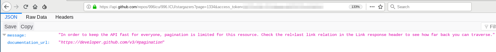
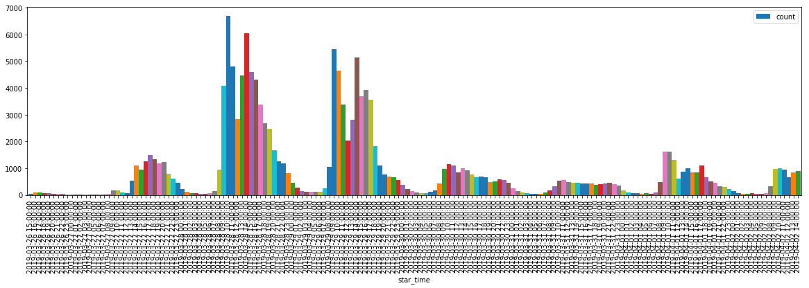

# Get Profile Data Of Repo Stargazers GraghQL

This Python has almost the same function as [minimaxir / get-profile-data-of-repo-stargazers](https://github.com/minimaxir/get-profile-data-of-repo-stargazers), but rewritten using the GraphQL API of GitHub, which is much more faster and can overcome the scraw limit in page 1334 using the REST API.

I wrote this on my personal analysis project, the "StarTime-StarCount" chart in that project as below.

# Usage

1. Get an access token from your GitHub account.
2. Write your access token to line 9 of `main.py`.
3. Set the owner and repo name in line 9,10 of `main.py`.
4. Set timezone in line 103 and 107, default is UTC-5.
5. Run the script!

# Author

Nova Kwok

# LICENSE

GPLv3
